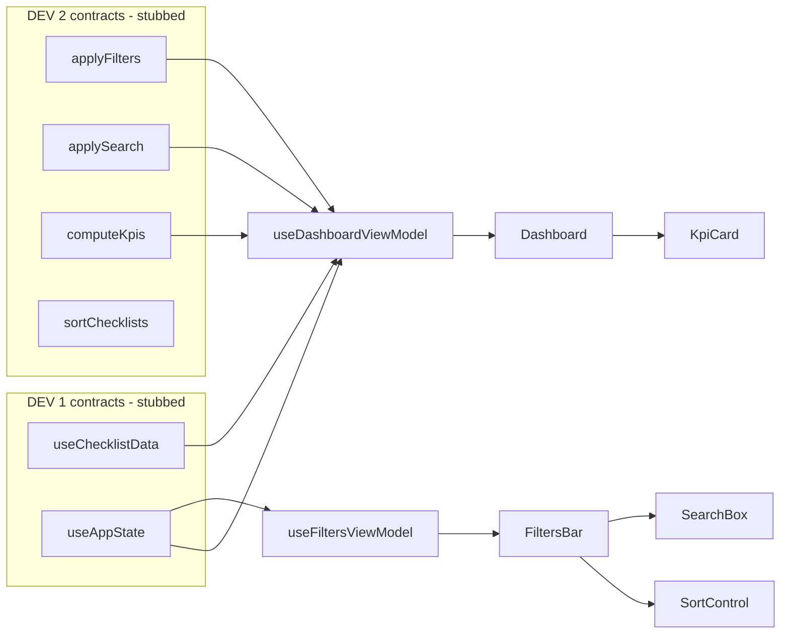

# DEV 3 — Dashboard de KPIs + Barra de Filtros/Ordenação/Busca

## Context & constraints
- Source of truth: [docs/divisao-features-devs.md](docs/divisao-features-devs.md) (DEV 3 section + §6 contracts) and [SPEC.md](SPEC.md) (FR-002, FR-005, FR-006, FR-010, FR-014, FR-015).
- Standards from [CLAUDE.md](CLAUDE.md): Aura-first (§1), DI via context (§3), ViewModel pattern with **no local `useState` for shared/host-synced state** (§5), test-first (§6), no `any`/`as` (§7).
- Domain entity `Checklist` already exists at [src/types/apm.ts](src/types/apm.ts) — reuse it.
- **Scope decision (user-confirmed, option B):** build ONLY DEV 3 files. DEV 1 (`useAppState`/`useChecklistData`) and DEV 2 (`computeKpis`/`applyFilters`/`applySearch`/`sortChecklists` + types) do not exist yet, so define the shared TYPES DEV 3 imports as a DEV 3-owned stub module, code against mocked contracts, and add `// TODO(DEV1/DEV2)` markers to swap stubs for real modules later.
- **Do not touch [src/App.tsx](src/App.tsx)** (DEV 1's property). Expose root components `<Dashboard/>`, `<FiltersBar/>` only.

## Architecture (data flow)

## Step 1 — DEV 3-owned contract stubs (so DEV 3 compiles & tests run)
Create `src/features/_contracts/` holding ONLY what DEV 3 imports. Each file is header-commented as a temporary stub.

- `domain.ts`: re-declare DEV 2 §6 types (`StatusBucket`, `Priority`, `SortKey`, `SortDir`, `Period`, `Filters`, `Kpis`) and stub fns `applyFilters`, `applySearch`, `computeKpis`, `sortChecklists` whose bodies `throw new Error('TODO(DEV2): ...')`. These stubs are only DI defaults; tests inject mocks, so they never execute.
- `platform.ts`: re-declare DEV 1 §6 types (`ActiveView`, `AppState`, `DEFAULT_STATE`, `ChecklistDataSource`) and stub hooks `useAppState`, `useChecklistData` that `throw new Error('TODO(DEV1): ...')`.
- `index.ts`: barrel.

When DEV 1/DEV 2 land, only the imports in the two ViewModels change (stub -> `src/platform` / `src/domain`); signatures stay identical.

## Step 2 — Shared test mock data
- `src/features/__mocks__/checklists.ts`: small `makeChecklist(overrides)` factory + a few sample `Checklist[]` (open, overdue, completed, distinct areas/priorities) reusing `Checklist` from [src/types/apm.ts](src/types/apm.ts). Fake URLs use `.test` TLD per CLAUDE.md.

## Step 3 — Dashboard (test-first)
Files under `src/features/dashboard/`:
- `use-dashboard-view-model.ts` + `.test.ts` — stateless VM. Context `DashboardViewModelContext` with default deps `{ useChecklistData, useAppState, applyFilters, applySearch, computeKpis }`. Returns `{ isLoading, isError, kpis, lastUpdatedAt, refresh }`. Pipeline: `applyFilters(checklists, filters, now)` -> `applySearch(_, search)` -> `computeKpis(_, now)` so **KPIs reflect active filters** (FR-006). `now` injected (default `() => Date.now()`).
- `kpi-card.tsx` + `.test.tsx` — pure Aura `Card` presenting one KPI; supports an `icon`+`text` emphasis variant so **overdue is never color-only** (FR-005, design.md accessibility).
- `dashboard.tsx` + `.test.tsx` — renders KPI cards: abertos, atrasados (with warning icon+label), `% no prazo (SLA)` via `Progress`, distribuição por status/prioridade/área (Badge lists). Handles loading (`Loader`), error (`Alert`), empty states.

VM tests (CLAUDE.md coverage): loading/error/success; correct derived KPIs from mocked `computeKpis`; changing filters re-runs pipeline; "somente atrasados" + área recorte reflected in KPIs.

## Step 4 — Filters / Sort / Search bar (test-first)
Files under `src/features/filters/`:
- `use-filters-view-model.ts` + `.test.ts` — stateless VM over `useAppState`. Exposes current `filters`/`sort`/`search` and semantic setters that delegate to `setFilters`/`setSort`/`setSearch` (host-synced; **no local `useState` for applied values**, §2/FR-011). Provides option lists (status buckets, priorities, periods). Optional `availableAreas` derived from data via injected `useChecklistData` (areas come from DEV 2 `deriveArea`; until then, derive from `Checklist.rootLocation?.title` with a TODO).
- `filters-bar.tsx` + `.test.tsx` — Aura controls: status multi (`DropdownMenu` + `DropdownMenuCheckboxItem`), "somente atrasados" toggle (`Button` pressed state, icon+text), prioridade multi, área multi, período (`Select`, default `30d`). Each change calls a setter.
- `sort-control.tsx` — `Select` for key (`prazo`/`status`) + `Button` toggling `asc`/`desc` (icon+text) -> `setSort`.
- `search-box.tsx` — `Input`/`InputGroup` with search icon; **local `useState` only for the in-flight input** with debounce, committing to `setSearch` (allowed transient per §2).

VM/component tests: setters call host-synced setters with correct payload; combinable filters; period defaults to `30d`; debounced search commits applied value.

## Step 5 — Verify
- `npm test` (Vitest) and `npm run lint` green; run `ReadLints` on new files.
- Confirm no `any`/`as`, all params typed, no raw hex (use Aura tokens), Aura-first.

## Out of scope (other devs)
- Real `src/platform/*` (DEV 1) and `src/domain/*` (DEV 2) implementations — only stubbed.
- Wiring into `App.tsx` and the list/table/drawer (DEV 4).
- View toggle (dashboard/list) is DEV 1 shell concern; left out unless requested.