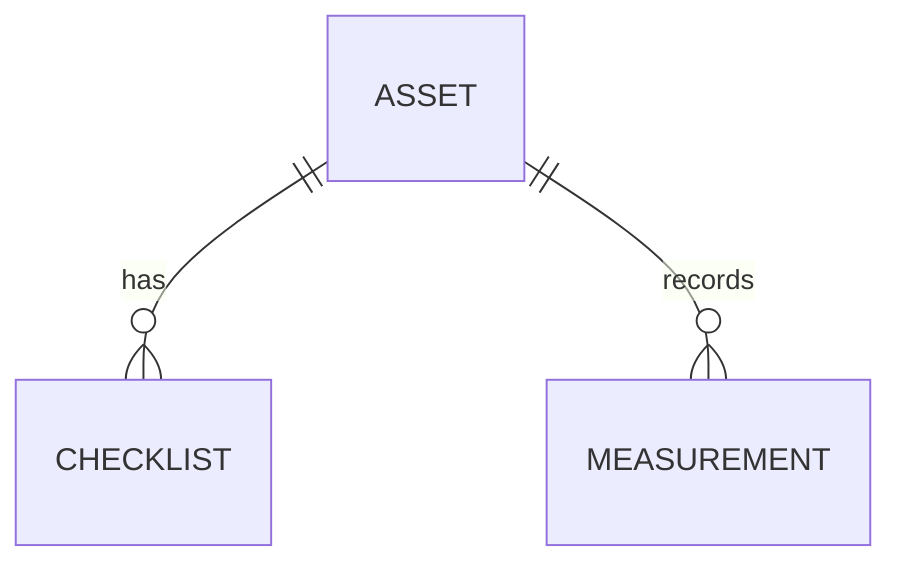

# Skill: dmbl-impact-analysis

## Purpose

Build a **DMBL (Data Model Business Lens)** — a lightweight, human-reviewable view of the data model focused on **business entities**, **main relationships**, **planned changes**, and **impacted reference data**.

DMBL is **not** a 1:1 replication of the Cognite DMS schema (containers, views, spaces, full property lists). It is the **planning and impact layer** that connects `SPEC.md`, technical data modeling, and seed design.

Use DMBL to answer:

- What entities and relations does this app actually need?
- What are we **changing** in the model (delta), not what already exists in CDF?
- Which **reference / master entities** must exist before seed or queries work?
- If we change X, what breaks or must be updated (CSV, queries, UI)?

---

# Related Prompts

- **`prompt_seed_dados.md`** (`create-cdf-seed`) — run **after** DMBL is reviewed; consumes `model/dmbl.md` and `model/impact-map.md` for CSV and coverage design.
- **`dm-limits-and-best-practices`** (repo skill) — when implementing queries/upserts after the model is clear.

---

# When to Use

Use this prompt when:

- Starting a new Cognite Flows app that depends on custom or extended data models
- Extending Cognite core / process industry models for a workshop app
- Planning seed data and need to know reference entities first
- Reviewing model + seed + app changes together in a PR or design session
- Onboarding the team on “what this app needs from the graph”

---

# When NOT to Use

Do NOT use this prompt when:

- You need the **authoritative** schema definition for CDF → use DMS / DML publish flow instead
- You want a full export of every container property from CDF without business filtering
- You are running a production migration (use a dedicated migration process)
- The model is unchanged and an approved `model/dmbl.md` already exists (reuse it)

---

# Core Principles

DMBL must be:

## Business-first

Use domain language (Asset, Checklist, Measurement), not only DMS external IDs.

---

## Delta-oriented

Document **as-is → to-be** changes. Do not dump the entire Cognite schema.

---

## Scoped to the app

Include only entities, relations, and properties the app **reads, writes, or filters on**.

---

## Reference-aware

Explicitly list master/reference data others depend on (sites, assets, catalogs, enums).

---

## Impact-traced

Every planned change maps to impacted seed files, queries, UI, and validation.

---

## Reviewable

Human approval gate before seed CSV generation (`Approved for seed design: yes`).

---

# Mandatory Inputs

Before writing DMBL, read and understand:

- **`SPEC.md`** (required) — user stories, screens, KPIs, scenarios
- **Training / tenant data model (if provided)** — e.g. **Space `cdf_apm`**, **Data model `ApmAppData`**. Query this model in CDF first; do not invent parallel checklist views if APM already covers the domain.
- **Cognite Core** — [dm_core_data_model](https://docs.cognite.com/cdf/dm/dm_reference/dm_core_data_model) (`cdf_cdm`) — assets via `asset` / `rootLocation` on APM views
- **Process industries** (if tenant has it) — [dm_process_industry_data_model](https://docs.cognite.com/cdf/dm/dm_reference/dm_process_industry_data_model) (`cdf_idm`)
- **Extending core** — [dm_extending_core_data_model](https://docs.cognite.com/cdf/dm/dm_guides/dm_extending_core_data_model)
- Optional: `PRD.md`, `specs/<feature>/spec.md`, `specs/design.md`
- Target data model: space, data model externalId/version (if known)
- List of **planned model changes** — prefer `REUSE` / `REUSE_IDM` before `ADD_CUSTOM`
- Optional: view list or DML snippet from CDF — use as **reference only**, not as copy target

---

# Critical Rules

1. **Confirm the project data model first** (e.g. `cdf_apm` / `ApmAppData`) — list its views and versions in CDF before proposing custom entities.
2. **Read Cognite CDM/IDM** — map assets and trends; APM views often link via `asset` / `rootLocation`.
3. **Do not replicate** the full Cognite DMS schema in DMBL.
4. **Do not duplicate** checklist/template/observation views that already exist in `ApmAppData` (or equivalent project DM).
5. **Do not duplicate** `CogniteAsset` / `CogniteTimeSeries` in a custom space when CDM covers them.
6. **Always document deltas** (`REUSE_APM`, `REUSE_CDM`, `REUSE_IDM`, `ADD_CUSTOM`) — `As-is` vs `To-be`.
7. **Always list reference entities** and blocking dependencies.
8. **Always produce an impact map** linking each change to seed, app, and validation work.
9. Run DMBL **after** `SPEC.md` exists and **before** `prompt_seed_dados.md` / CSV generation.
10. Produce **`model/workshop-data-model.dbml`** for [dbdiagram.io](https://dbdiagram.io) review before seed.
11. DMBL **complements** DML/DMS — use DMBL for planning; authoritative schema is what is published in CDF (`ApmAppData`, etc.).

---

# Recommended Repository Layout

```text
model/
├── dmbl.md                   # Main document (entities, relations, delta, references)
├── impact-map.md             # Change ID → impacted artifacts
├── workshop-data-model.dbml  # Proposed model (DBML) — review before seed
├── CDM-REFERENCES.md         # What to reuse from cdf_cdm / cdf_idm
└── dmbl-diagram.mmd          # Optional Mermaid ER diagram (business labels)
```

---

# Step 1 — Extract Business Entities (from SPEC)

List entities the app manipulates or displays.

Example section for `model/dmbl.md`:

```markdown
## Business entities

| Entity (business) | CDF view (if known) | Role in app | In scope |
|-------------------|---------------------|-------------|----------|
| Asset | CogniteAsset / custom | List, detail | Yes |
| Checklist | Checklist | Workflow | Yes |
| Time series | — | Not used directly | No |
```

**Rule:** omit views/containers the app never touches.

---

# Step 2 — Map Main Relationships

Document cardinality and direction in business terms.

```markdown
## Relationships

| From | To | Cardinality | Edge / property | Required for seed? | Notes |
|------|-----|-------------|-----------------|-------------------|-------|
| Checklist | Asset | N:1 | assetExternalId | Yes | FK in CSV |
| Measurement | Asset | N:1 | asset ref | Yes | Trend charts |
```

Optional `model/dmbl-diagram.mmd`:



Publicação técnica: DML/DMS a partir do DBML acordado (`model/workshop-data-model.dbml`).

---

# Step 2b — Proposed model in DBML (when as-is is insufficient)

If the existing CDF model **does not support** the app (per SPEC and Step 3 delta), produce **`model/workshop-data-model.dbml`** (or `<app>-data-model.dbml`):

- Logical tables = **CDF views** the app needs (not every core property)
- `external_id` columns = deterministic CDF `externalId` for seed
- Enums = property enums in containers
- `Ref` / edge tables = direct relations or edge types
- `Note` blocks = CDF space, `@import` for core views, seed order
- Mark **as-is** (import/link only) vs **to-be** (new custom views)

**Human gate:** reviewer opens DBML in [dbdiagram.io](https://dbdiagram.io) or VS Code **before** approving seed design.

Do not generate seed CSV until DBML + DMBL are aligned.

---

Capture **only changes** relevant to this app.

```markdown
## Model delta

### As-is (current in CDF)

- CogniteAsset in space `sp_assets` (read-only for app)
- No Checklist view yet

### To-be (planned)

| Change ID | Type | Description | DMS hint (optional) |
|-----------|------|-------------|---------------------|
| DM-001 | ADD_ENTITY | Checklist view | space X, view Y |
| DM-002 | ADD_EDGE | Checklist → Asset | direct relation |
| DM-003 | ADD_PROPERTY | status enum | container Z |
```

**Change types:** `ADD_ENTITY`, `REMOVE_ENTITY`, `RENAME`, `ADD_PROPERTY`, `REMOVE_PROPERTY`, `ADD_EDGE`, `CHANGE_CARDINALITY`, `CHANGE_SPACE`.

If the model is greenfield, document **To-be only** and mark As-is as empty or N/A.

---

# Step 4 — Reference Entities & Dependencies

List master/reference data required before transactional instances.

```markdown
## Reference entities

| Entity | Why required | Seed required? | Existing in CDF? | Blocking? |
|--------|--------------|----------------|------------------|-----------|
| Site | Parent of assets | Yes | Unknown | Yes |
| Asset | Checklist anchor | Yes | Partial | Yes |
| Status enum | Checklist status | Yes (values in CSV) | No | Yes |
```

**Blocking dependency example:** cannot seed Checklist until Asset external IDs exist.

---

# Step 5 — Impact Map

For each change ID, trace impact across the stack.

Write `model/impact-map.md`:

```markdown
## Impact map

| Change ID | Impacted area | Action required | Owner |
|-----------|---------------|-----------------|-------|
| DM-001 | seed/csv/nodes-Checklist.csv | Create CSV + mapping | seed |
| DM-001 | seed/SEED_STRATEGY.md | Add coverage rows | seed |
| DM-001 | App hook useChecklists | New instances.query | app |
| DM-002 | seed/scripts/validate-csv.ts | FK check Checklist→Asset | seed |
| DM-003 | SPEC.md scenario "overdue" | Add enum + CSV rows | spec + seed |
```

**Areas to scan for impact:**

- `model/*`, `seed/csv/*`, `seed/mapping/*`, `seed/SEED_STRATEGY.md`
- Generated SDK / view types
- App hooks, queries, filters, routes
- Dashboards, KPIs, notifications
- Post-upload validation queries

---

# Step 6 — Seed & Scenario Implications

Bridge DMBL → seed design (input for `prompt_seed_dados.md`):

```markdown
## Seed implications

| Business entity | Min rows | Scenarios (from SPEC) | Planned CSV |
|-----------------|----------|-------------------------|-------------|
| Asset | 5 | happy-path, alert | nodes-Asset.csv |
| Checklist | 8 | happy-path, overdue | nodes-Checklist.csv |
```

Confirm every reference entity has a plan: **seed in CSV**, **already in CDF**, or **explicit gap** (blocker).

---

# Step 7 — Human Review Gate (mandatory)

**Do not start seed CSV generation until DMBL is reviewed.**

## Review checklist

- [ ] Entities match `SPEC.md` (no orphan UI features)
- [ ] Relationships match how the app navigates and queries data
- [ ] Model delta is complete — no hidden schema change
- [ ] Reference entities and blocking dependencies are explicit
- [ ] Impact map covers seed CSV, validation, and app surfaces
- [ ] Seed implications table is bounded (workshop-appropriate volumes)

## Approval record

Add to the bottom of `model/dmbl.md`:

```text
DMBL reviewed by: <name>
Date: <YYYY-MM-DD>
Approved for seed design: yes
```

Only proceed to `prompt_seed_dados.md` when **Approved for seed design: yes**.

---

# Step 8 — Deliverables

Return to the user:

## DMBL package

- `model/dmbl.md` — entities, relationships, delta, references, approval
- `model/impact-map.md` — change → impact
- `model/workshop-data-model.dbml` — proposed logical model (when to-be required)
- Optional `model/dmbl-diagram.mmd`

---

## Executive summary

3–5 bullets:

- Main entities and relations
- Top reference dependencies
- Biggest model changes
- Top 3 risks if model/seed/app diverge

---

# Cognite Flows Best Practice

Always follow:

```text
SPEC.md
    ↓
DMBL (model/dmbl.md + workshop-data-model.dbml + impact-map.md)  →  human review & approval
    ↓
Data Model publish (DMS / DML — technical schema)
    ↓
prompt_seed_dados.md  →  CSV  →  review  →  upload
    ↓
Application Development
```

Never:

```text
Publish DM + seed CSV
    ↓
Discover missing reference entity
    ↓
Reverse-engineer relationships in the app
```

Never:

```text
Dump full CDF schema into dmbl.md
    ↓
Lose sight of what the app actually needs
```

The specification and DMBL should drive the model and seed.

The seed should never drive undocumented model assumptions.

If the model changes mid-project, **update DMBL and impact-map first**, then adjust seed CSV and app queries.
